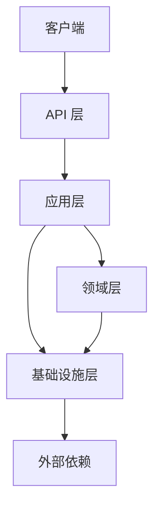

# 架构概览

本文档介绍 CrestCreates 框架的整体架构设计。

## 设计目标

CrestCreates 框架的设计目标是：

1. **高可维护性**：通过清晰的分层和模块化设计，提高代码的可维护性
2. **高可测试性**：通过依赖注入和接口抽象，便于单元测试和集成测试
3. **高可扩展性**：通过模块化设计和插件机制，支持功能的动态扩展
4. **高灵活性**：通过多 ORM 支持和可替换组件，适应不同的技术栈需求

## 架构概览



## 分层架构

### 领域层（Domain）

**职责**：实现业务逻辑和领域规则

**主要组件**：
- **实体（Entity）** 和 **聚合根（AggregateRoot）**：业务核心概念
- **值对象（ValueObject）**：不可变的领域概念
- **领域事件（DomainEvent）**：领域内的消息传递
- **仓储接口（IRepository）**：数据访问抽象
- **工作单元（IUnitOfWork）**：事务管理

**特点**：
- 独立于外部依赖
- 纯业务逻辑
- 通过领域事件实现松耦合

### 应用层（Application）

**职责**：协调领域对象完成用例

**主要组件**：
- **应用服务（Application Service）**：编排业务流程
- **DTO（Data Transfer Object）**：数据传输对象
- **命令和查询处理**：CQRS 模式实现
- **事件处理器（EventHandler）**：处理领域事件

**特点**：
- 编排业务流程
- 处理跨领域操作
- 不包含业务逻辑

### 基础设施层（Infrastructure）

**职责**：提供技术实现和外部集成

**主要组件**：
- **ORM 实现**：EF Core、FreeSql、SqlSugar
- **事件总线**：本地（MediatR）和分布式（RabbitMQ）
- **缓存**：内存缓存和 Redis 缓存
- **日志**：Serilog 集成
- **授权和认证**：RBAC 授权体系
- **多租户支持**：租户识别和数据隔离

**特点**：
- 处理技术细节
- 隔离外部依赖
- 实现领域层定义的接口

### API 层（Web）

**职责**：处理 HTTP 请求和响应

**主要组件**：
- **控制器（Controller）**：API 端点
- **中间件（Middleware）**：请求处理管道
- **路由配置**：URL 路由
- **请求/响应处理**：HTTP 特定逻辑

**特点**：
- 与客户端交互
- 处理 HTTP 特定逻辑
- 调用应用层服务

## 模块化设计

### 模块定义

- **IModule** 接口：定义模块的基本方法
- **ModuleBase** 抽象类：提供模块的默认实现
- **ModuleAttribute**：标记模块并指定依赖关系

### 模块生命周期

1. **初始化**：模块被发现和加载
2. **配置服务**：注册模块提供的服务
3. **配置应用**：配置应用级别的设置
4. **启动**：模块启动逻辑
5. **停止**：模块停止逻辑

### 模块依赖管理

- 支持模块间依赖声明
- 自动拓扑排序，确保依赖正确加载
- 循环依赖检测

## 核心功能实现

### 领域驱动设计（DDD）

- **实体和聚合根**：实现业务核心概念
- **值对象**：实现不可变的领域概念
- **领域事件**：实现领域内的消息传递
- **仓储**：封装数据访问逻辑
- **工作单元**：管理事务和数据一致性

### 多 ORM 支持

- **抽象接口**：定义统一的数据访问接口
- **EF Core 实现**：支持 Entity Framework Core
- **FreeSql 实现**：支持 FreeSql ORM
- **SqlSugar 实现**：支持 SqlSugar ORM
- **自动代码生成**：生成仓储实现代码

### 事件总线

- **本地事件总线**：基于 MediatR 实现
- **分布式事件总线**：基于 RabbitMQ 实现
- **事件存储**：支持事件持久化和重放

### 缓存系统

- **内存缓存**：基于 Microsoft.Extensions.Caching.Memory
- **Redis 缓存**：基于 StackExchange.Redis
- **缓存键生成**：统一的缓存键生成策略
- **缓存过期策略**：支持绝对过期和滑动过期

### 日志系统

- **Serilog 集成**：支持结构化日志
- **多输出目标**：控制台、文件、数据库、Seq
- **日志级别管理**：支持动态调整日志级别

### 多租户支持

- **租户识别**：支持多种租户解析方式
- **连接字符串解析**：为不同租户提供不同的数据库连接
- **数据隔离**：基于鉴别器的多租户数据隔离

### RBAC 授权体系

- **权限定义**：支持细粒度的权限定义
- **角色管理**：支持基于角色的权限分配
- **权限检查**：支持声明式和命令式权限检查

## 项目结构

```
CrestCreates/
├── framework/                    # 框架核心
│   ├── src/                      # 源代码
│   │   ├── CrestCreates.Domain/              # 领域层
│   │   ├── CrestCreates.Domain.Shared/       # 领域共享
│   │   ├── CrestCreates.Application/         # 应用层
│   │   ├── CrestCreates.Application.Contracts/ # 应用层接口
│   │   ├── CrestCreates.Infrastructure/      # 基础设施层
│   │   ├── CrestCreates.Web/                 # API 层
│   │   ├── CrestCreates.MultiTenancy/        # 多租户支持
│   │   ├── CrestCreates.OrmProviders.Abstract/ # ORM 抽象
│   │   ├── CrestCreates.OrmProviders.EFCore/ # EF Core 实现
│   │   ├── CrestCreates.OrmProviders.FreeSqlProvider/ # FreeSql 实现
│   │   └── CrestCreates.OrmProviders.SqlSugar/ # SqlSugar 实现
│   ├── test/                     # 测试项目
│   └── tools/                    # 工具
│       └── CrestCreates.CodeGenerator/       # 代码生成器
├── samples/                      # 示例项目
│   └── Ecommerce/                # 电商示例
├── docs/                         # 文档
└── README.md                     # 项目说明
```

## 相关文档

- [领域驱动设计](01-domain-driven-design.md) - DDD 设计原则
- [分层架构](02-layered-architecture.md) - 分层架构详解
- [模块化设计](03-modularity.md) - 模块化开发指南
- [技术栈](04-technology-stack.md) - 技术栈说明
