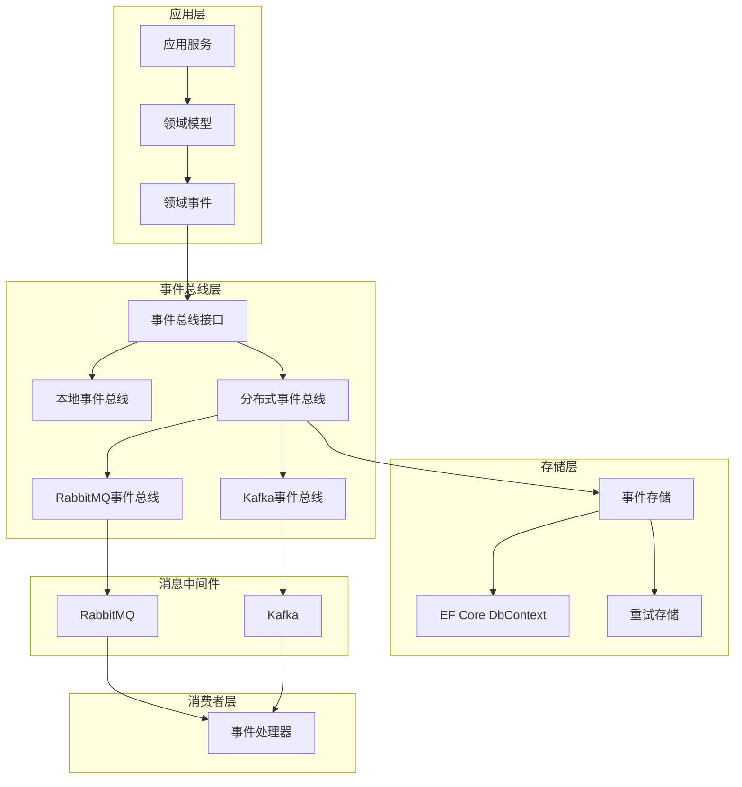

# 分布式事件总线实施计划

## 📋 计划概述

根据 `e:\WorkSpace\Personel\CrestCreates\docs\analysis\未完成功能分析.md` 文档中的需求，本计划旨在完成分布式事件总线功能模块的开发，包括 RabbitMQ 和 Kafka 支持、事件存储和重试机制。

## 1. 功能需求分析

### 1.1 现有基础

- ✅ 领域事件接口定义
- ✅ 实体中添加/清除事件
- ✅ 本地事件总线实现

### 1.2 缺失功能

- ❌ 分布式事件总线（RabbitMQ/Kafka）
- ❌ 事件存储和重试机制
- ❌ 事件溯源支持

### 1.3 功能需求

1. **分布式事件总线**
   - 支持 RabbitMQ 作为消息中间件
   - 支持 Kafka 作为消息中间件
   - 提供统一的事件总线接口
   - 支持事件的发布和订阅

2. **事件存储和重试机制**
   - 实现事件的持久化存储
   - 支持事件发布失败的重试机制
   - 提供事件重试策略配置

3. **事件溯源支持**
   - 实现事件的完整记录
   - 支持基于事件的状态重建
   - 提供事件查询和回放功能

## 2. 技术选型评估

### 2.1 消息中间件选型

| 中间件 | 优势 | 劣势 | 适用场景 |
|-------|------|------|----------|
| RabbitMQ | 可靠性高、支持多种协议、成熟稳定 | 吞吐量相对较低 | 对可靠性要求高的场景 |
| Kafka | 高吞吐量、水平扩展能力强、持久化存储 | 配置复杂、学习曲线较陡 | 高并发、大数据量场景 |

### 2.2 技术依赖

- **RabbitMQ.Client**: RabbitMQ 客户端库
- **Confluent.Kafka**: Kafka 客户端库
- **Microsoft.EntityFrameworkCore**: 事件存储
- **Newtonsoft.Json**/**System.Text.Json**: 事件序列化

### 2.3 技术栈选择

- **核心框架**: .NET 8.0+
- **消息中间件**: RabbitMQ 3.10+ 和 Kafka 3.0+
- **数据存储**: 关系型数据库（使用现有 EF Core 集成）
- **序列化**: System.Text.Json

## 3. 系统架构设计

### 3.1 架构图



### 3.2 核心组件

1. **EventBus**: 事件总线接口，定义事件发布和订阅方法
2. **DistributedEventBusBase**: 分布式事件总线抽象基类
3. **RabbitMqEventBus**: RabbitMQ 实现的分布式事件总线
4. **KafkaEventBus**: Kafka 实现的分布式事件总线
5. **EventStore**: 事件存储服务，负责事件的持久化
6. **EventRetryService**: 事件重试服务，处理发布失败的事件
7. **EventSerializer**: 事件序列化服务，负责事件的序列化和反序列化

## 4. 核心组件开发方案

### 4.1 EventBus 接口

```csharp
public interface IEventBus
{
    Task PublishAsync<TEvent>(TEvent @event, CancellationToken cancellationToken = default) where TEvent : class, IDomainEvent;
    Task SubscribeAsync<TEvent, THandler>() where TEvent : class, IDomainEvent where THandler : IEventHandler<TEvent>;
    Task UnsubscribeAsync<TEvent, THandler>() where TEvent : class, IDomainEvent where THandler : IEventHandler<TEvent>;
}
```

### 4.2 分布式事件总线基类

```csharp
public abstract class DistributedEventBusBase : IEventBus
{
    protected readonly IEventSerializer _serializer;
    protected readonly IEventStore _eventStore;
    protected readonly IEventRetryService _retryService;

    public DistributedEventBusBase(IEventSerializer serializer, IEventStore eventStore, IEventRetryService retryService)
    {
        _serializer = serializer;
        _eventStore = eventStore;
        _retryService = retryService;
    }

    public abstract Task PublishAsync<TEvent>(TEvent @event, CancellationToken cancellationToken = default) where TEvent : class, IDomainEvent;
    public abstract Task SubscribeAsync<TEvent, THandler>() where TEvent : class, IDomainEvent where THandler : IEventHandler<TEvent>;
    public abstract Task UnsubscribeAsync<TEvent, THandler>() where TEvent : class, IDomainEvent where THandler : IEventHandler<TEvent>;

    protected async Task PublishWithRetryAsync<TEvent>(TEvent @event, Func<Task> publishAction, CancellationToken cancellationToken = default) where TEvent : class, IDomainEvent
    {
        try
        {
            await publishAction();
            await _eventStore.MarkAsPublishedAsync(@event.Id, cancellationToken);
        }
        catch (Exception ex)
        {
            await _retryService.AddToRetryQueueAsync(@event, ex, cancellationToken);
            throw;
        }
    }
}
```

### 4.3 RabbitMQ 事件总线

```csharp
public class RabbitMqEventBus : DistributedEventBusBase
{
    private readonly IConnection _connection;
    private readonly IModel _channel;
    private readonly string _exchangeName;

    public RabbitMqEventBus(
        IEventSerializer serializer,
        IEventStore eventStore,
        IEventRetryService retryService,
        RabbitMqEventBusOptions options)
        : base(serializer, eventStore, retryService)
    {
        var factory = new ConnectionFactory
        {
            HostName = options.HostName,
            Port = options.Port,
            UserName = options.UserName,
            Password = options.Password,
            VirtualHost = options.VirtualHost
        };

        _connection = factory.CreateConnection();
        _channel = _connection.CreateModel();
        _exchangeName = options.ExchangeName;

        _channel.ExchangeDeclare(
            exchange: _exchangeName,
            type: ExchangeType.Topic,
            durable: true,
            autoDelete: false);
    }

    public override async Task PublishAsync<TEvent>(TEvent @event, CancellationToken cancellationToken = default) where TEvent : class, IDomainEvent
    {
        var eventType = @event.GetType().FullName;
        var routingKey = eventType;
        var eventData = _serializer.Serialize(@event);

        var properties = _channel.CreateBasicProperties();
        properties.Persistent = true;
        properties.MessageId = @event.Id.ToString();
        properties.Type = eventType;

        await _eventStore.StoreAsync(@event, cancellationToken);

        await PublishWithRetryAsync(@event, async () =>
        {
            _channel.BasicPublish(
                exchange: _exchangeName,
                routingKey: routingKey,
                basicProperties: properties,
                body: Encoding.UTF8.GetBytes(eventData));
        }, cancellationToken);
    }

    public override Task SubscribeAsync<TEvent, THandler>() where TEvent : class, IDomainEvent where THandler : IEventHandler<TEvent>
    {
        var eventType = typeof(TEvent).FullName;
        var queueName = $"{eventType}.{typeof(THandler).Name}";

        _channel.QueueDeclare(
            queue: queueName,
            durable: true,
            exclusive: false,
            autoDelete: false);

        _channel.QueueBind(
            queue: queueName,
            exchange: _exchangeName,
            routingKey: eventType);

        var consumer = new EventingBasicConsumer(_channel);
        consumer.Received += async (model, ea) =>
        {
            var eventData = Encoding.UTF8.GetString(ea.Body.Span);
            var @event = _serializer.Deserialize<TEvent>(eventData);

            var handler = Activator.CreateInstance<THandler>();
            await handler.HandleAsync(@event);

            _channel.BasicAck(ea.DeliveryTag, multiple: false);
        };

        _channel.BasicConsume(
            queue: queueName,
            autoAck: false,
            consumer: consumer);

        return Task.CompletedTask;
    }

    public override Task UnsubscribeAsync<TEvent, THandler>() where TEvent : class, IDomainEvent where THandler : IEventHandler<TEvent>
    {
        var eventType = typeof(TEvent).FullName;
        var queueName = $"{eventType}.{typeof(THandler).Name}";

        _channel.QueueDelete(queue: queueName);

        return Task.CompletedTask;
    }
}
```

### 4.4 Kafka 事件总线

```csharp
public class KafkaEventBus : DistributedEventBusBase
{
    private readonly IProducer<Null, string> _producer;
    private readonly string _topic;

    public KafkaEventBus(
        IEventSerializer serializer,
        IEventStore eventStore,
        IEventRetryService retryService,
        KafkaEventBusOptions options)
        : base(serializer, eventStore, retryService)
    {
        var config = new ProducerConfig
        {
            BootstrapServers = options.BootstrapServers,
            ClientId = options.ClientId,
            Acks = Acks.All
        };

        _producer = new ProducerBuilder<Null, string>(config).Build();
        _topic = options.Topic;
    }

    public override async Task PublishAsync<TEvent>(TEvent @event, CancellationToken cancellationToken = default) where TEvent : class, IDomainEvent
    {
        var eventData = _serializer.Serialize(@event);

        await _eventStore.StoreAsync(@event, cancellationToken);

        await PublishWithRetryAsync(@event, async () =>
        {
            var message = new Message<Null, string>
            {
                Value = eventData,
                Headers = new Headers
                {
                    { "MessageId", Encoding.UTF8.GetBytes(@event.Id.ToString()) },
                    { "EventType", Encoding.UTF8.GetBytes(@event.GetType().FullName) }
                }
            };

            await _producer.ProduceAsync(_topic, message, cancellationToken);
        }, cancellationToken);
    }

    public override Task SubscribeAsync<TEvent, THandler>() where TEvent : class, IDomainEvent where THandler : IEventHandler<TEvent>
    {
        var config = new ConsumerConfig
        {
            BootstrapServers = "localhost:9092",
            GroupId = $"{typeof(THandler).Name}",
            AutoOffsetReset = AutoOffsetReset.Earliest,
            EnableAutoCommit = false
        };

        using var consumer = new ConsumerBuilder<Ignore, string>(config).Build();
        consumer.Subscribe(_topic);

        Task.Run(() =>
        {
            while (true)
            {
                try
                {
                    var consumeResult = consumer.Consume();
                    var eventType = consumeResult.Message.Headers.First(h => h.Key == "EventType").GetValueBytes();
                    var eventTypeString = Encoding.UTF8.GetString(eventType);
                    var eventData = consumeResult.Message.Value;

                    if (eventTypeString == typeof(TEvent).FullName)
                    {
                        var @event = _serializer.Deserialize<TEvent>(eventData);
                        var handler = Activator.CreateInstance<THandler>();
                        handler.HandleAsync(@event).Wait();
                    }

                    consumer.Commit(consumeResult);
                }
                catch (ConsumeException e)
                {
                    Console.WriteLine($"Error consuming message: {e.Error.Reason}");
                }
            }
        });

        return Task.CompletedTask;
    }

    public override Task UnsubscribeAsync<TEvent, THandler>() where TEvent : class, IDomainEvent where THandler : IEventHandler<TEvent>
    {
        // Kafka 消费组会自动处理订阅关系
        return Task.CompletedTask;
    }
}
```

### 4.5 事件存储

```csharp
public interface IEventStore
{
    Task StoreAsync<TEvent>(TEvent @event, CancellationToken cancellationToken = default) where TEvent : class, IDomainEvent;
    Task MarkAsPublishedAsync(Guid eventId, CancellationToken cancellationToken = default);
    Task<IEnumerable<StoredEvent>> GetUnpublishedEventsAsync(CancellationToken cancellationToken = default);
    Task<StoredEvent> GetEventByIdAsync(Guid eventId, CancellationToken cancellationToken = default);
}

public class EfCoreEventStore : IEventStore
{
    private readonly CrestCreatesDbContext _dbContext;

    public EfCoreEventStore(CrestCreatesDbContext dbContext)
    {
        _dbContext = dbContext;
    }

    public async Task StoreAsync<TEvent>(TEvent @event, CancellationToken cancellationToken = default) where TEvent : class, IDomainEvent
    {
        var storedEvent = new StoredEvent
        {
            Id = @event.Id,
            EventType = @event.GetType().FullName,
            Data = JsonSerializer.Serialize(@event),
            CreationTime = DateTime.UtcNow,
            IsPublished = false
        };

        await _dbContext.StoredEvents.AddAsync(storedEvent, cancellationToken);
        await _dbContext.SaveChangesAsync(cancellationToken);
    }

    public async Task MarkAsPublishedAsync(Guid eventId, CancellationToken cancellationToken = default)
    {
        var storedEvent = await _dbContext.StoredEvents.FirstOrDefaultAsync(e => e.Id == eventId, cancellationToken);
        if (storedEvent != null)
        {
            storedEvent.IsPublished = true;
            storedEvent.PublishedTime = DateTime.UtcNow;
            await _dbContext.SaveChangesAsync(cancellationToken);
        }
    }

    public async Task<IEnumerable<StoredEvent>> GetUnpublishedEventsAsync(CancellationToken cancellationToken = default)
    {
        return await _dbContext.StoredEvents.Where(e => !e.IsPublished).ToListAsync(cancellationToken);
    }

    public async Task<StoredEvent> GetEventByIdAsync(Guid eventId, CancellationToken cancellationToken = default)
    {
        return await _dbContext.StoredEvents.FirstOrDefaultAsync(e => e.Id == eventId, cancellationToken);
    }
}
```

### 4.6 事件重试服务

```csharp
public interface IEventRetryService
{
    Task AddToRetryQueueAsync<TEvent>(TEvent @event, Exception exception, CancellationToken cancellationToken = default) where TEvent : class, IDomainEvent;
    Task ProcessRetryQueueAsync(CancellationToken cancellationToken = default);
}

public class EventRetryService : IEventRetryService
{
    private readonly IEventStore _eventStore;
    private readonly IEventBus _eventBus;
    private readonly EventRetryOptions _options;

    public EventRetryService(IEventStore eventStore, IEventBus eventBus, EventRetryOptions options)
    {
        _eventStore = eventStore;
        _eventBus = eventBus;
        _options = options;
    }

    public async Task AddToRetryQueueAsync<TEvent>(TEvent @event, Exception exception, CancellationToken cancellationToken = default) where TEvent : class, IDomainEvent
    {
        var retryEvent = new EventRetry
        {
            Id = Guid.NewGuid(),
            EventId = @event.Id,
            EventType = @event.GetType().FullName,
            Data = JsonSerializer.Serialize(@event),
            ExceptionMessage = exception.Message,
            RetryCount = 0,
            NextRetryTime = DateTime.UtcNow.AddSeconds(_options.InitialRetryDelaySeconds),
            CreationTime = DateTime.UtcNow
        };

        // 存储到数据库
        // 这里需要在 DbContext 中添加 EventRetry 实体
    }

    public async Task ProcessRetryQueueAsync(CancellationToken cancellationToken = default)
    {
        // 获取需要重试的事件
        // 这里需要从数据库中查询 NextRetryTime <= DateTime.UtcNow 的事件

        // 对每个事件进行重试
        // 如果重试成功，从重试队列中移除
        // 如果重试失败，更新重试次数和下次重试时间
    }
}
```

## 5. 接口定义规范

### 5.1 事件接口

```csharp
public interface IDomainEvent
{
    Guid Id { get; }
    DateTime CreationTime { get; }
    string EventType { get; }
}

public abstract class DomainEvent : IDomainEvent
{
    public Guid Id { get; protected set; }
    public DateTime CreationTime { get; protected set; }
    public string EventType { get; protected set; }

    protected DomainEvent()
    {
        Id = Guid.NewGuid();
        CreationTime = DateTime.UtcNow;
        EventType = GetType().FullName;
    }
}
```

### 5.2 事件处理器接口

```csharp
public interface IEventHandler<TEvent> where TEvent : class, IDomainEvent
{
    Task HandleAsync(TEvent @event, CancellationToken cancellationToken = default);
}
```

### 5.3 事件总线配置选项

```csharp
public class RabbitMqEventBusOptions
{
    public string HostName { get; set; } = "localhost";
    public int Port { get; set; } = 5672;
    public string UserName { get; set; } = "guest";
    public string Password { get; set; } = "guest";
    public string VirtualHost { get; set; } = "/";
    public string ExchangeName { get; set; } = "domain-events";
}

public class KafkaEventBusOptions
{
    public string BootstrapServers { get; set; } = "localhost:9092";
    public string ClientId { get; set; } = "domain-event-producer";
    public string Topic { get; set; } = "domain-events";
}

public class EventRetryOptions
{
    public int InitialRetryDelaySeconds { get; set; } = 5;
    public int MaxRetryAttempts { get; set; } = 5;
    public double RetryBackoffMultiplier { get; set; } = 2.0;
    public int MaxRetryDelaySeconds { get; set; } = 3600;
}
```

## 6. 数据流转流程

### 6.1 事件发布流程

1. 应用服务或领域模型创建领域事件
2. 调用事件总线的 PublishAsync 方法
3. 事件总线将事件存储到事件存储中
4. 事件总线将事件发布到消息中间件（RabbitMQ/Kafka）
5. 如果发布失败，将事件添加到重试队列
6. 如果发布成功，标记事件为已发布

### 6.2 事件订阅流程

1. 应用启动时，注册事件处理器
2. 事件总线创建消费者，订阅消息中间件的事件
3. 收到事件后，反序列化事件对象
4. 调用对应的事件处理器处理事件
5. 确认事件处理完成

### 6.3 事件重试流程

1. 定时任务或后台服务调用 ProcessRetryQueueAsync 方法
2. 获取需要重试的事件
3. 对每个事件进行重试
4. 如果重试成功，从重试队列中移除
5. 如果重试失败，更新重试次数和下次重试时间
6. 如果达到最大重试次数，将事件标记为失败

## 7. 错误处理机制

### 7.1 发布错误处理

- **网络错误**: 自动重试，使用指数退避策略
- **消息中间件错误**: 记录错误，添加到重试队列
- **序列化错误**: 记录错误，标记为失败

### 7.2 订阅错误处理

- **处理器错误**: 记录错误，继续处理下一个事件
- **反序列化错误**: 记录错误，丢弃事件
- **网络错误**: 自动重连

### 7.3 存储错误处理

- **数据库错误**: 记录错误，尝试重试
- **事务错误**: 回滚事务，记录错误

## 8. 性能优化策略

### 8.1 发布性能优化

- **批量发布**: 支持批量发布多个事件
- **异步发布**: 使用异步方法，避免阻塞主线程
- **连接池**: 使用连接池管理消息中间件连接
- **序列化优化**: 使用高性能序列化库

### 8.2 订阅性能优化

- **并行处理**: 支持并行处理多个事件
- **批量消费**: 批量拉取消息，减少网络往返
- **消费者组**: 使用消费者组提高并行度

### 8.3 存储性能优化

- **批量存储**: 批量存储多个事件
- **索引优化**: 为事件存储表添加适当的索引
- **缓存**: 缓存常用的事件数据

## 9. 测试计划与验收标准

### 9.1 单元测试

- **事件总线接口测试**: 测试事件发布和订阅方法
- **RabbitMQ 事件总线测试**: 测试 RabbitMQ 发布和订阅
- **Kafka 事件总线测试**: 测试 Kafka 发布和订阅
- **事件存储测试**: 测试事件存储和查询
- **事件重试测试**: 测试事件重试机制

### 9.2 集成测试

- **完整流程测试**: 测试从事件创建到处理的完整流程
- **错误处理测试**: 测试各种错误场景的处理
- **性能测试**: 测试高并发场景下的性能
- **可靠性测试**: 测试消息中间件故障时的恢复能力

### 9.3 验收标准

- **功能验收**: 所有功能需求都已实现
- **性能验收**: 发布和订阅延迟小于 100ms
- **可靠性验收**: 消息丢失率小于 0.1%
- **可扩展性验收**: 支持水平扩展

## 10. 实施时间表及资源分配方案

### 10.1 实施时间表

| 阶段 | 时间 | 任务 |
|------|------|------|
| 准备阶段 | 1周 | 环境搭建、依赖安装、技术选型确认 |
| 核心组件开发 | 2周 | 实现事件总线接口、分布式事件总线基类、事件存储、事件重试服务 |
| 消息中间件集成 | 2周 | 实现 RabbitMQ 事件总线、Kafka 事件总线 |
| 测试阶段 | 1周 | 编写单元测试、集成测试、性能测试 |
| 部署阶段 | 1周 | 配置、部署、监控设置 |

### 10.2 资源分配方案

| 角色 | 人数 | 职责 |
|------|------|------|
| 系统架构师 | 1 | 架构设计、技术选型 |
| 后端开发 | 2 | 核心组件开发、消息中间件集成 |
| 测试工程师 | 1 | 编写测试用例、执行测试 |
| DevOps | 1 | 环境搭建、部署配置 |

## 11. 风险与应对措施

### 11.1 技术风险

| 风险 | 影响 | 应对措施 |
|------|------|----------|
| 消息中间件故障 | 事件发布失败 | 实现重试机制，使用多个消息中间件实例 |
| 网络延迟 | 事件处理延迟 | 优化网络配置，使用本地消息表保证可靠性 |
| 序列化性能 | 发布订阅性能 | 使用高性能序列化库，如 MessagePack |

### 11.2 业务风险

| 风险 | 影响 | 应对措施 |
|------|------|----------|
| 事件丢失 | 业务逻辑不一致 | 实现事件存储和重试机制 |
| 事件重复 | 业务逻辑重复执行 | 实现幂等性处理 |
| 事件顺序 | 业务逻辑顺序错误 | 使用消息中间件的顺序保证机制 |

## 12. 结论

本实施计划详细描述了分布式事件总线功能模块的开发方案，包括功能需求分析、技术选型评估、系统架构设计、核心组件开发方案、接口定义规范、数据流转流程、错误处理机制、性能优化策略、测试计划与验收标准、实施时间表及资源分配方案。通过本计划的实施，可以实现一个可靠、高性能、可扩展的分布式事件总线系统，支持 RabbitMQ 和 Kafka 作为消息中间件，提供事件存储和重试机制，为框架的微服务架构提供强大的事件驱动能力。