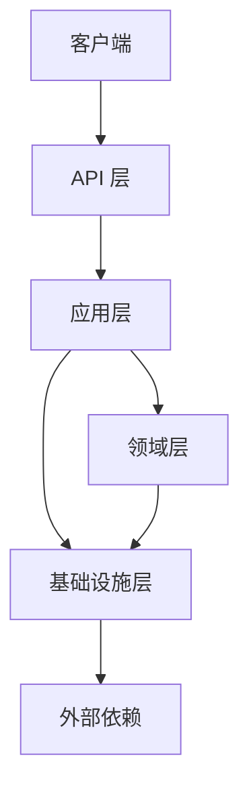

# CrestCreates 框架 - 架构设计文档

## 📋 总览

CrestCreates 是一个基于 .NET 10.0 的现代化应用框架，采用领域驱动设计 (DDD) 理念，提供了完整的基础设施和工具链，帮助开发者快速构建高质量的企业级应用。

## 🏗️ 架构设计

### 1. 分层架构

CrestCreates 采用经典的分层架构，清晰分离关注点，提高代码可维护性和可测试性。



#### 1.1 领域层 (Domain)

- **核心职责**：实现业务逻辑和领域规则
- **主要组件**：
  - 实体 (Entity) 和聚合根 (AggregateRoot)
  - 值对象 (ValueObject)
  - 领域事件 (DomainEvent)
  - 仓储接口 (IRepository)
  - 工作单元 (IUnitOfWork)
- **特点**：独立于外部依赖，纯业务逻辑

#### 1.2 应用层 (Application)

- **核心职责**：协调领域对象完成用例
- **主要组件**：
  - 应用服务 (Application Service)
  - DTO (Data Transfer Object)
  - 命令和查询处理
  - 事件处理器 (EventHandler)
- **特点**：编排业务流程，处理跨领域操作

#### 1.3 基础设施层 (Infrastructure)

- **核心职责**：提供技术实现和外部集成
- **主要组件**：
  - ORM 实现 (EF Core, FreeSql, SqlSugar)
  - 事件总线 (Local, RabbitMQ)
  - 缓存 (Memory, Redis)
  - 日志 (Serilog)
  - 授权和认证
  - 多租户支持
- **特点**：处理技术细节，隔离外部依赖

#### 1.4 API 层 (Web)

- **核心职责**：处理 HTTP 请求和响应
- **主要组件**：
  - 控制器 (Controller)
  - 中间件 (Middleware)
  - 路由配置
  - 请求/响应处理
- **特点**：与客户端交互，处理 HTTP 特定逻辑

### 2. 模块化设计

CrestCreates 支持模块化开发，通过模块系统实现功能的按需加载和隔离。

#### 2.1 模块定义

- **IModule** 接口：定义模块的基本方法
- **ModuleBase** 抽象类：提供模块的默认实现
- **ModuleAttribute**：标记模块并指定依赖关系

#### 2.2 模块生命周期

1. **初始化**：模块被发现和加载
2. **配置服务**：注册模块提供的服务
3. **配置应用**：配置应用级别的设置
4. **启动**：模块启动逻辑
5. **停止**：模块停止逻辑

#### 2.3 模块依赖管理

- 支持模块间依赖声明
- 自动拓扑排序，确保依赖正确加载
- 循环依赖检测

### 3. 核心功能实现

#### 3.1 领域驱动设计 (DDD)

- **实体和聚合根**：实现业务核心概念
- **值对象**：实现不可变的领域概念
- **领域事件**：实现领域内的消息传递
- **仓储**：封装数据访问逻辑
- **工作单元**：管理事务和数据一致性

#### 3.2 多 ORM 支持

- **抽象接口**：定义统一的数据访问接口
- **EF Core 实现**：支持 Entity Framework Core
- **FreeSql 实现**：支持 FreeSql ORM
- **SqlSugar 实现**：支持 SqlSugar ORM
- **自动代码生成**：生成仓储实现代码

#### 3.3 事件总线

- **本地事件总线**：基于 MediatR 实现
- **分布式事件总线**：基于 RabbitMQ 实现
- **事件存储**：支持事件持久化和重放

#### 3.4 缓存系统

- **内存缓存**：基于 Microsoft.Extensions.Caching.Memory
- **Redis 缓存**：基于 StackExchange.Redis
- **缓存键生成**：统一的缓存键生成策略
- **缓存过期策略**：支持绝对过期和滑动过期

#### 3.5 日志系统

- **Serilog 集成**：支持结构化日志
- **多输出目标**：控制台、文件、数据库、Seq
- **日志级别管理**：支持动态调整日志级别

#### 3.6 多租户支持

- **租户识别**：支持多种租户解析方式
- **连接字符串解析**：为不同租户提供不同的数据库连接
- **数据隔离**：基于鉴别器的多租户数据隔离

#### 3.7 RBAC 授权体系

- **权限定义**：支持细粒度的权限定义
- **角色管理**：支持基于角色的权限分配
- **权限检查**：支持声明式和命令式权限检查

### 4. 技术栈

| 类别 | 技术/框架 | 版本 |
|------|-----------|------|
| 基础框架 | .NET | 10.0 |
| ORM | Entity Framework Core | 7.0.0 |
| ORM | FreeSql | 3.5.215 |
| ORM | SqlSugar | 5.1.4.104 |
| 中介者模式 | MediatR | 11.1.0 |
| 缓存 | StackExchange.Redis | 2.7.10 |
| 日志 | Serilog | 3.1.1 |
| 消息队列 | RabbitMQ.Client | 6.5.0 |
| 测试 | xUnit | 2.6.2 |
| 测试 | Moq | 4.20.69 |
| 测试 | AutoFixture | 4.17.0 |

## 📁 项目结构

```
CrestCreates/
├── framework/
│   ├── src/
│   │   ├── CrestCreates.Domain/             # 领域层
│   │   ├── CrestCreates.Domain.Shared/      # 领域共享
│   │   ├── CrestCreates.Application/        # 应用层
│   │   ├── CrestCreates.Application.Contracts/ # 应用层接口
│   │   ├── CrestCreates.Infrastructure/     # 基础设施层
│   │   ├── CrestCreates.Web/                # API 层
│   │   ├── CrestCreates.MultiTenancy/       # 多租户支持
│   │   ├── CrestCreates.MultiTenancy.Abstract/ # 多租户抽象
│   │   ├── CrestCreates.OrmProviders.Abstract/ # ORM 抽象
│   │   ├── CrestCreates.OrmProviders.EFCore/ # EF Core 实现
│   │   ├── CrestCreates.OrmProviders.FreeSqlProvider/ # FreeSql 实现
│   │   ├── CrestCreates.OrmProviders.SqlSugar/ # SqlSugar 实现
│   │   └── CrestCreates.DbContextProvider.Abstract/ # DbContext 抽象
│   ├── test/
│   │   ├── CrestCreates.TestBase/           # 测试基类
│   │   ├── CrestCreates.Domain.Tests/       # 领域层测试
│   │   ├── CrestCreates.Application.Tests/  # 应用层测试
│   │   ├── CrestCreates.IntegrationTests/   # 集成测试
│   │   ├── CrestCreates.OrmProviders.Tests/ # ORM 测试
│   │   └── CrestCreates.CodeGenerator.Tests/ # 代码生成器测试
│   └── tools/
│       └── CrestCreates.CodeGenerator/      # 代码生成器
├── docs/                                    # 文档
├── .gitignore
├── CrestCreates.sln
├── Directory.Build.props
├── Directory.Packages.props
└── README.md
```

## 🔧 核心组件

### 1. 领域层组件

- **Entity<TId>**：实体基类，提供 ID 和领域事件支持
- **AggregateRoot<TId>**：聚合根基类，领域的一致性边界
- **ValueObject**：值对象基类，不可变的领域概念
- **DomainEvent**：领域事件基类，用于领域内的消息传递
- **IRepository<TEntity, TId>**：仓储接口，封装数据访问
- **IUnitOfWork**：工作单元接口，管理事务

### 2. 应用层组件

- **ApplicationService**：应用服务基类，协调领域对象完成用例
- **DTO**：数据传输对象，用于应用层和 API 层之间的数据传递
- **EventHandler**：事件处理器，处理领域事件

### 3. 基础设施层组件

- **DomainEventPublisher**：领域事件发布器，基于 MediatR 实现
- **LocalEventBus**：本地事件总线，基于 MediatR 实现
- **RabbitMqEventBus**：分布式事件总线，基于 RabbitMQ 实现
- **MemoryCache**：内存缓存实现
- **RedisCache**：Redis 缓存实现
- **SerilogLoggerAdapter**：Serilog 日志适配器
- **EfCoreUnitOfWork**：EF Core 工作单元实现
- **FreeSqlUnitOfWork**：FreeSql 工作单元实现
- **SqlSugarUnitOfWork**：SqlSugar 工作单元实现

### 4. API 层组件

- **Controller**：API 控制器，处理 HTTP 请求
- **Middleware**：中间件，处理请求管道
- **Startup**：应用启动配置

## 🚀 快速开始

### 1. 项目初始化

1. 克隆代码库
2. 运行 `dotnet restore` 恢复依赖
3. 运行 `dotnet build` 构建项目

### 2. 创建模块

1. 创建一个新的类库项目
2. 实现 `IModule` 接口或继承 `ModuleBase`
3. 使用 `CrestModuleAttribute` 标记模块
4. 在 `ConfigureServices` 方法中注册服务

### 3. 定义实体

1. 创建实体类，继承 `Entity<TId>` 或 `AggregateRoot<TId>`
2. 使用 `EntityAttribute` 标记实体
3. 定义实体属性和行为

### 4. 实现应用服务

1. 创建应用服务接口，定义服务方法
2. 实现应用服务，协调领域对象完成用例
3. 使用 `CrestServiceAttribute` 标记服务

### 5. 配置 API 控制器

1. 创建控制器类，继承 `ControllerBase`
2. 注入应用服务
3. 实现 API 端点

## 📝 最佳实践

### 1. 领域驱动设计

- **保持领域层纯净**：领域层不应依赖任何外部库
- **使用值对象**：对于不可变的领域概念，使用值对象
- **发布领域事件**：对于重要的领域变化，发布领域事件
- **使用聚合根**：通过聚合根管理领域对象的一致性

### 2. 模块化开发

- **合理划分模块**：根据业务功能划分模块
- **明确依赖关系**：使用 `ModuleAttribute` 声明模块依赖
- **保持模块内聚**：模块应包含相关的功能
- **避免循环依赖**：模块间不应形成循环依赖

### 3. 数据访问

- **使用仓储模式**：通过仓储接口访问数据
- **使用工作单元**：通过工作单元管理事务
- **选择合适的 ORM**：根据项目需求选择合适的 ORM
- **避免直接访问数据库**：应通过仓储和工作单元访问数据库

### 4. 事件处理

- **使用领域事件**：对于领域内的重要变化，使用领域事件
- **使用事件总线**：对于跨服务的通信，使用事件总线
- **实现事件处理器**：及时处理领域事件
- **考虑事件持久化**：对于重要事件，考虑持久化存储

### 5. 缓存策略

- **合理使用缓存**：对于频繁访问的数据，使用缓存
- **选择合适的缓存策略**：根据数据特性选择合适的缓存策略
- **设置合理的过期时间**：避免缓存数据过期
- **处理缓存一致性**：确保缓存与数据源的一致性

### 6. 日志记录

- **使用结构化日志**：使用 Serilog 的结构化日志功能
- **设置合理的日志级别**：根据环境和需求设置合理的日志级别
- **包含足够的上下文信息**：日志应包含足够的上下文信息
- **避免敏感信息**：日志不应包含敏感信息

## 🔮 未来规划

1. **支持更多 ORM**：添加对更多 ORM 的支持
2. **支持更多消息队列**：添加对 Kafka 等消息队列的支持
3. **支持更多缓存提供者**：添加对更多缓存系统的支持
4. **增强代码生成器**：提供更多代码生成功能
5. **添加更多测试工具**：提供更多测试辅助工具
6. **支持云原生**：添加对云原生环境的支持
7. **提供更多示例**：提供更多实际应用示例

## 📄 许可证

CrestCreates 框架采用 MIT 许可证，详见 LICENSE 文件。
